# ardftsrc Quality Report: High

Revision: 90ba09d

## Preset Configuration

| Field     |          Value |
|-----------|----------------|
| Quality   |          73622 |
| Bandwidth |         0.9874 |
| Taper     | Cosine(3.4375) |
| Phase     |              0 |

## HydrogenAudio Test Suite

Local HydrogenAudio Test Suite run, `f64`, `dd_fft` off. See <https://src.hydrogenaudio.org/> for the test suite's own scoring methodology.

| Metric               |      Score |
|----------------------|------------|
| Balanced score       |     99.32% |
| Spectrogram          |     99.40% |
| Bandwidth            |     99.08% |
| Impulse frequency    |     98.79% |
| Average impulse freq | -333.89 dB |
| Aliasing             |    100.00% |
| Pre-ringing          |     17.87% |
| Gapless              |    100.00% |
| Intermodulation      |     98.80% |
| Delay                |    100.00% |

### Spectrogram of a sweep 1 to 22 kHz

A sine sweep from 1 to 22 kHz. The ideal plot is a single strong red line. Issues with aliasing effects or filter cutoff would show as extra lines. Noise would appear as dots across the plot (instead of a black background). [96 kHz source resampled to 44 kHz]

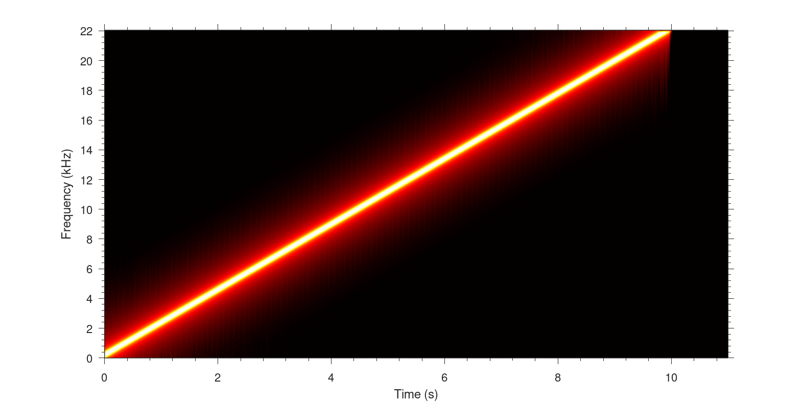

### Spectrogram of a sweep 1 to 22 kHz (extended)

The source signal included a sine sweep all the way up to 44 kHz, however when downsampled to 44 kHz the highest frequency which can be represented is 22 kHz. This plot would show if the sine above 22 kHz is filtering down into the plot, there should be nothing plotted after 10 seconds. [96 kHz source resampled to 44 kHz]

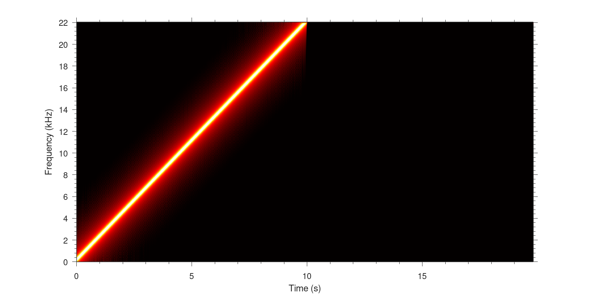

### Aliasing

A 23 kHz sine at -4 dBFS with a white noise floor of -150 dBFS over 30 seconds. The ideal plot is a continuous line touching the -150dB line, many SRC routines engage a gradual filter at 20 kHz which would be visible on this plot. [96 kHz source resampled to 44 kHz]

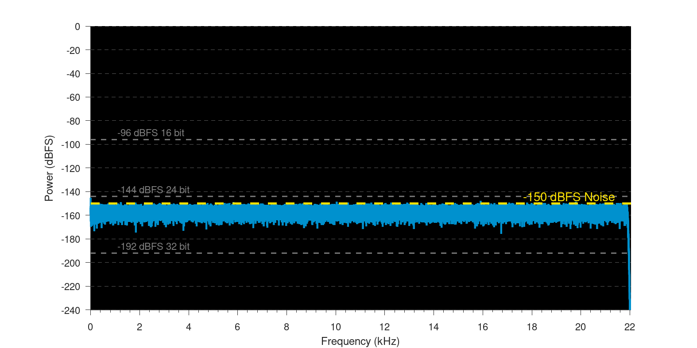

### Nyquist Filter

Zoomed on nyquist frequency (22.050 kHz), the bandwidth of the SRC is displayed. A SRC with 100% bandwidth, that is full frequency preservation would be a straight line of noise. [96 kHz source resampled to 44 kHz]

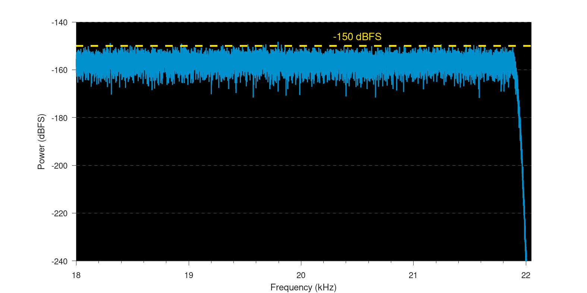

### Intermodulation Harmonic Distortion

Two sine waves one at 64.59 Hz, -6 dBFS and the second at 6998 Hz, -18.0412 dBFS, which equals quarter the amplitude of the first sine. This test will highlight aliasing and dynamic range of processing. It will also show if dither has been applied, look for high frequency signals on the plot. [96 kHz source resampled to 44 kHz]

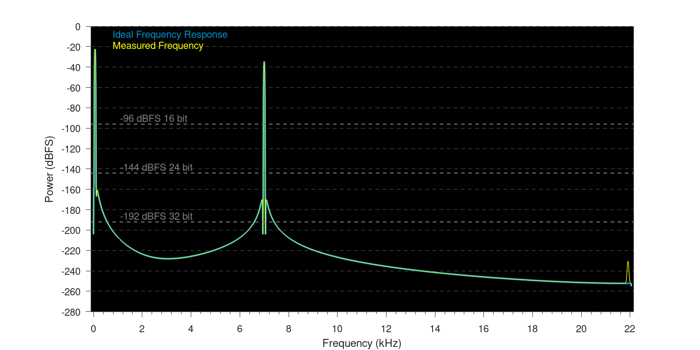

### Intermodulation Harmonic Distortion (difference)

The difference between the ideal and measured signals from the Intermodulation Harmonic Distortion test. [96 kHz source resampled to 44 kHz]

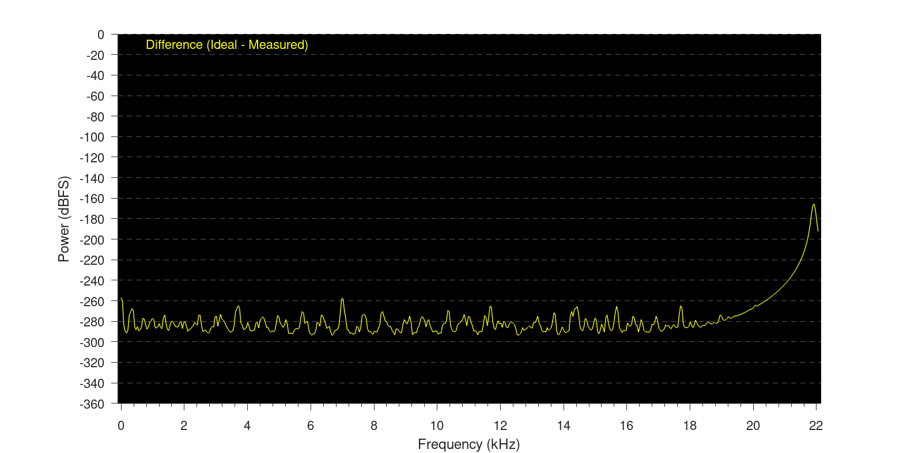

### Impulse Frequency

A frequency response displaying leakage beyond the ideal frequency response. Impulses are at sample positions n so that {n mod 320} is a permutation of {0, 1, 2, . . . , 319}. All fractional differences in sample positions between input and output signal are addressed exactly once. The output signal is upsampled to 14.112 MHz and the impulse responses are added to obtain a high resolution impulse response. [96 kHz source resampled to 44 kHz]

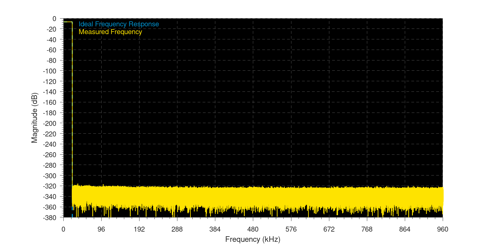

### Impulse Response

Displays the phase response, most SRC balance the response with pre and post ringing, personal preference might prefer a minimum phase response where there is no pre-ringing. The ideal response is not shown because a post-ringing representation, would not tally with the other ideal plots (phase, etc). [96 kHz source resampled to 44 kHz]

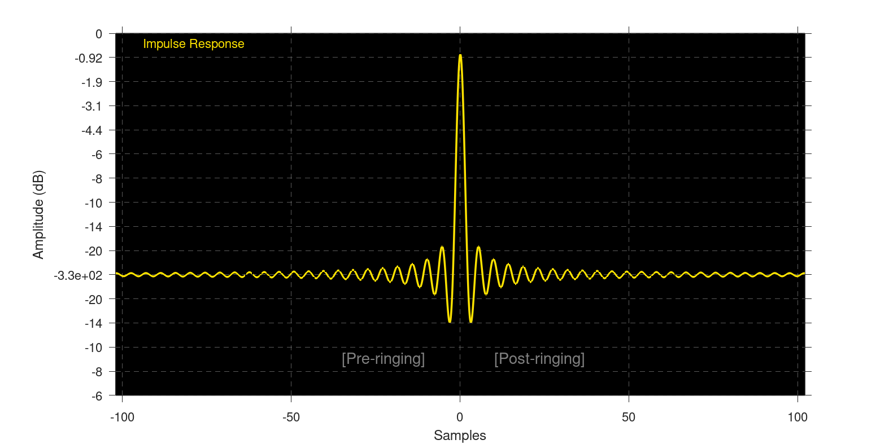

### Impulse Phase

The actual phase across the frequency range. [96 kHz source resampled to 44 kHz]

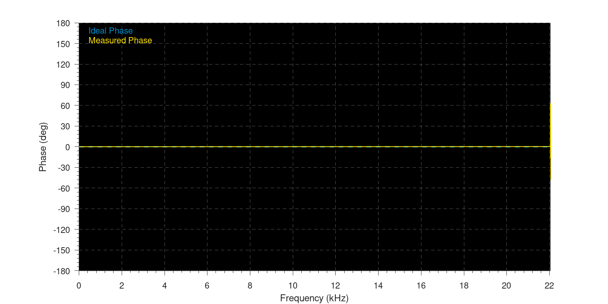

### Impulse Passband

Displays the SRC filter used close to the nyquist frequency. [96 kHz source resampled to 44 kHz]

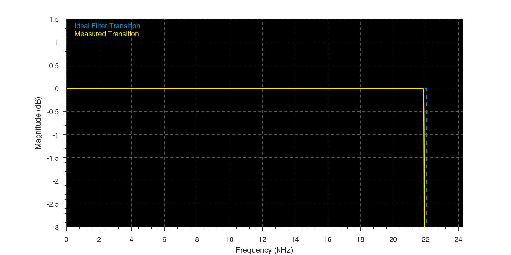

### Impulse Transition

A zoomed plot of the nyquist frequency showing the filter response. [96 kHz source resampled to 44 kHz]

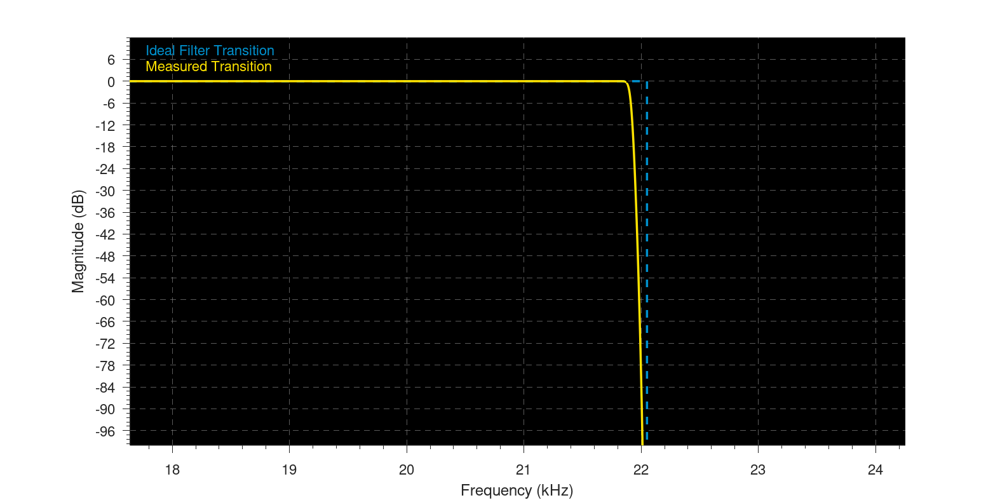

### Gapless Sine

A sine wave is split into two, both are resampled independently. This plot is the two signals joined back together. The blue line shows the transition after resampling. Deviation from sine wave shape likely means an audible glitch. Any value over +1 would clip if later not corrected. [96 kHz source resampled to 44 kHz]

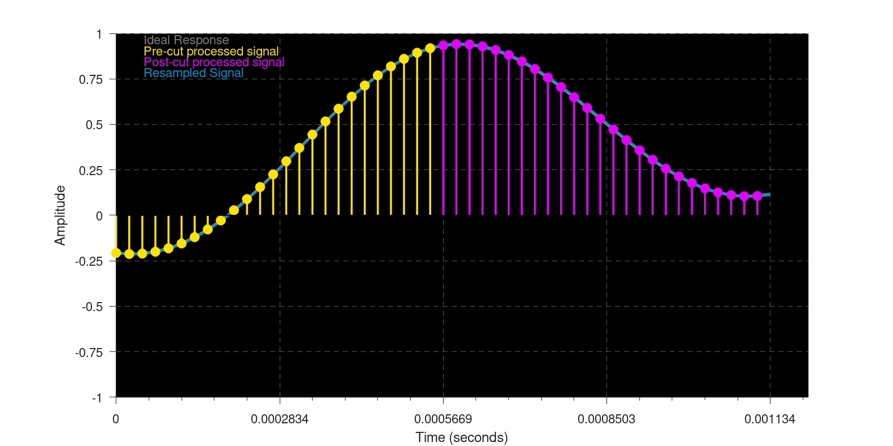

### Gapless Sine (frequency plot)

A frequency plot of the gapless sine test. [96 kHz source resampled to 44 kHz]

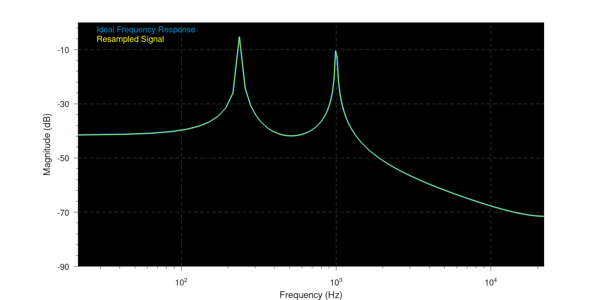

## THD+N

`f64` only. Broadband THD+N covers DC-Nyquist (time-domain sine fit, no FFT); audio-band THD+N is limited to 20 Hz-20000 Hz. Values at or below the -300 dB noise floor reflect the plain-`f64` analyzer's own precision ceiling.

† Gain error is below 1e-9 dB. It is below f64 round-off error.

### Summary (worst case per configuration)

| Rate pair       | Decimate | dd_fft | Worst broadband THD+N (dB) | Worst audio-band THD+N (dB) | Worst gain error (dB) | Worst spur (dB) |
|-----------------|----------|--------|----------------------------|-----------------------------|-----------------------|-----------------|
| 44100 -> 48000  | false    | false  |                    -222.86 |                     -223.57 |                   0 † |         -233.14 |
| 44100 -> 48000  | false    | true   |                    -222.86 |                     -223.57 |                   0 † |         -233.14 |
| 48000 -> 44100  | false    | false  |                    -216.05 |                     -218.43 |                   0 † |         -221.96 |
| 48000 -> 44100  | false    | true   |                    -216.05 |                     -218.43 |                   0 † |         -221.96 |
| 44100 -> 96000  | false    | false  |                    -222.86 |                     -226.00 |                   0 † |         -233.14 |
| 44100 -> 96000  | false    | true   |                    -222.86 |                     -226.00 |                   0 † |         -233.14 |
| 96000 -> 44100  | false    | false  |                    -217.81 |                     -219.92 |                   0 † |         -224.15 |
| 96000 -> 44100  | false    | true   |                    -217.81 |                     -219.92 |                   0 † |         -224.15 |
| 192000 -> 48000 | false    | false  |                    -219.27 |                     -219.27 |                   0 † |         -224.44 |
| 192000 -> 48000 | false    | true   |                    -219.27 |                     -219.27 |                   0 † |         -224.44 |
| 192000 -> 48000 | true     | false  |                    -219.27 |                     -219.27 |              -4.65e-7 |         -224.44 |
| 192000 -> 48000 | true     | true   |                    -219.27 |                     -219.27 |              -4.65e-7 |         -224.44 |
### 44100 -> 48000, decimate=false, dd_fft=false

| Freq (Hz) | Amplitude (dBFS) | Broadband THD+N (dB) | Audio-band THD+N (dB) | Gain error (dB) | Max spur (dB @ Hz) |
|-----------|------------------|----------------------|-----------------------|-----------------|--------------------|
|        20 |               -1 |              -236.62 |               -239.86 |             0 † |       -241.71 @ 20 |
|        20 |              -20 |              -236.63 |               -239.87 |             0 † |       -241.71 @ 20 |
|        20 |              -60 |              -236.62 |               -239.87 |             0 † |       -241.71 @ 20 |
|       100 |               -1 |              -231.31 |               -231.31 |             0 † |      -236.46 @ 100 |
|       100 |              -20 |              -231.31 |               -231.31 |             0 † |      -236.46 @ 100 |
|       100 |              -60 |              -231.30 |               -231.30 |             0 † |      -236.46 @ 100 |
|      1000 |               -1 |              -229.36 |               -229.38 |             0 † |     -234.57 @ 1000 |
|      1000 |              -20 |              -229.35 |               -229.37 |             0 † |     -234.57 @ 1000 |
|      1000 |              -60 |              -229.35 |               -229.37 |             0 † |     -234.56 @ 1000 |
|      5000 |               -1 |              -236.08 |               -236.76 |             0 † |     -245.39 @ 3954 |
|      5000 |              -20 |              -235.96 |               -236.62 |             0 † |     -245.39 @ 3954 |
|      5000 |              -60 |              -236.06 |               -236.74 |             0 † |     -245.39 @ 3954 |
|     10000 |               -1 |              -230.06 |               -230.76 |             0 † |     -239.37 @ 1046 |
|     10000 |              -20 |              -230.06 |               -230.76 |             0 † |     -239.37 @ 1046 |
|     10000 |              -60 |              -230.05 |               -230.75 |             0 † |     -239.37 @ 1046 |
|     15000 |               -1 |              -224.29 |               -224.91 |             0 † |    -235.75 @ 15000 |
|     15000 |              -20 |              -224.29 |               -224.91 |             0 † |    -235.75 @ 15000 |
|     15000 |              -60 |              -224.29 |               -224.91 |             0 † |    -235.75 @ 15000 |
|     18000 |               -1 |              -222.88 |               -223.86 |             0 † |    -233.14 @ 18000 |
|     18000 |              -20 |              -222.88 |               -223.86 |             0 † |    -233.14 @ 18000 |
|     18000 |              -60 |              -222.88 |               -223.86 |             0 † |    -233.14 @ 18000 |
|     20000 |               -1 |              -222.86 |               -223.57 |             0 † |    -233.35 @ 19046 |
|     20000 |              -20 |              -222.86 |               -223.57 |             0 † |    -233.35 @ 19046 |
|     20000 |              -60 |              -222.86 |               -223.57 |             0 † |    -233.35 @ 19046 |
### 44100 -> 48000, decimate=false, dd_fft=true

| Freq (Hz) | Amplitude (dBFS) | Broadband THD+N (dB) | Audio-band THD+N (dB) | Gain error (dB) | Max spur (dB @ Hz) |
|-----------|------------------|----------------------|-----------------------|-----------------|--------------------|
|        20 |               -1 |              -236.62 |               -239.86 |             0 † |       -241.71 @ 20 |
|        20 |              -20 |              -236.63 |               -239.87 |             0 † |       -241.71 @ 20 |
|        20 |              -60 |              -236.62 |               -239.86 |             0 † |       -241.71 @ 20 |
|       100 |               -1 |              -231.31 |               -231.31 |             0 † |      -236.46 @ 100 |
|       100 |              -20 |              -231.31 |               -231.31 |             0 † |      -236.46 @ 100 |
|       100 |              -60 |              -231.30 |               -231.30 |             0 † |      -236.46 @ 100 |
|      1000 |               -1 |              -229.36 |               -229.38 |             0 † |     -234.57 @ 1000 |
|      1000 |              -20 |              -229.35 |               -229.37 |             0 † |     -234.56 @ 1000 |
|      1000 |              -60 |              -229.35 |               -229.37 |             0 † |     -234.56 @ 1000 |
|      5000 |               -1 |              -236.08 |               -236.76 |             0 † |     -245.39 @ 3954 |
|      5000 |              -20 |              -235.96 |               -236.62 |             0 † |     -245.39 @ 3954 |
|      5000 |              -60 |              -236.06 |               -236.74 |             0 † |     -245.39 @ 3954 |
|     10000 |               -1 |              -230.06 |               -230.76 |             0 † |     -239.37 @ 1046 |
|     10000 |              -20 |              -230.06 |               -230.76 |             0 † |     -239.37 @ 1046 |
|     10000 |              -60 |              -230.05 |               -230.75 |             0 † |     -239.37 @ 1046 |
|     15000 |               -1 |              -224.29 |               -224.91 |             0 † |    -235.75 @ 15000 |
|     15000 |              -20 |              -224.29 |               -224.91 |             0 † |    -235.75 @ 15000 |
|     15000 |              -60 |              -224.29 |               -224.91 |             0 † |    -235.75 @ 15000 |
|     18000 |               -1 |              -222.88 |               -223.86 |             0 † |    -233.14 @ 18000 |
|     18000 |              -20 |              -222.88 |               -223.86 |             0 † |    -233.14 @ 18000 |
|     18000 |              -60 |              -222.88 |               -223.86 |             0 † |    -233.14 @ 18000 |
|     20000 |               -1 |              -222.86 |               -223.57 |             0 † |    -233.35 @ 19046 |
|     20000 |              -20 |              -222.86 |               -223.57 |             0 † |    -233.35 @ 19046 |
|     20000 |              -60 |              -222.86 |               -223.57 |             0 † |    -233.35 @ 19046 |
### 48000 -> 44100, decimate=false, dd_fft=false

| Freq (Hz) | Amplitude (dBFS) | Broadband THD+N (dB) | Audio-band THD+N (dB) | Gain error (dB) | Max spur (dB @ Hz) |
|-----------|------------------|----------------------|-----------------------|-----------------|--------------------|
|        20 |               -1 |              -229.37 |               -232.61 |             0 † |       -234.45 @ 20 |
|        20 |              -20 |              -229.37 |               -232.61 |             0 † |       -234.45 @ 20 |
|        20 |              -60 |              -229.37 |               -232.61 |             0 † |       -234.45 @ 20 |
|       100 |               -1 |              -239.73 |               -239.73 |             0 † |      -244.89 @ 100 |
|       100 |              -20 |              -239.73 |               -239.73 |             0 † |      -244.89 @ 100 |
|       100 |              -60 |              -239.73 |               -239.73 |             0 † |      -244.89 @ 100 |
|      1000 |               -1 |              -230.57 |               -230.59 |             0 † |     -235.80 @ 1000 |
|      1000 |              -20 |              -230.57 |               -230.59 |             0 † |     -235.80 @ 1000 |
|      1000 |              -60 |              -230.57 |               -230.59 |             0 † |     -235.80 @ 1000 |
|      5000 |               -1 |              -235.84 |               -237.15 |             0 † |    -245.76 @ 13554 |
|      5000 |              -20 |              -235.84 |               -237.15 |             0 † |    -245.76 @ 13554 |
|      5000 |              -60 |              -235.84 |               -237.14 |             0 † |    -245.76 @ 13554 |
|     10000 |               -1 |              -223.83 |               -223.90 |             0 † |    -230.17 @ 10000 |
|     10000 |              -20 |              -223.83 |               -223.90 |             0 † |    -230.17 @ 10000 |
|     10000 |              -60 |              -223.83 |               -223.90 |             0 † |    -230.17 @ 10000 |
|     15000 |               -1 |              -221.56 |               -221.58 |             0 † |    -229.00 @ 15000 |
|     15000 |              -20 |              -221.56 |               -221.58 |             0 † |    -229.00 @ 15000 |
|     15000 |              -60 |              -221.56 |               -221.58 |             0 † |    -229.00 @ 15000 |
|     18000 |               -1 |              -224.39 |               -224.76 |             0 † |    -234.29 @ 17058 |
|     18000 |              -20 |              -224.39 |               -224.76 |             0 † |    -234.29 @ 17058 |
|     18000 |              -60 |              -224.39 |               -224.76 |             0 † |    -234.29 @ 17058 |
|     20000 |               -1 |              -216.05 |               -218.43 |             0 † |    -221.96 @ 20000 |
|     20000 |              -20 |              -216.05 |               -218.43 |             0 † |    -221.96 @ 20000 |
|     20000 |              -60 |              -216.05 |               -218.43 |             0 † |    -221.96 @ 20000 |
### 48000 -> 44100, decimate=false, dd_fft=true

| Freq (Hz) | Amplitude (dBFS) | Broadband THD+N (dB) | Audio-band THD+N (dB) | Gain error (dB) | Max spur (dB @ Hz) |
|-----------|------------------|----------------------|-----------------------|-----------------|--------------------|
|        20 |               -1 |              -229.37 |               -232.61 |             0 † |       -234.45 @ 20 |
|        20 |              -20 |              -229.37 |               -232.61 |             0 † |       -234.45 @ 20 |
|        20 |              -60 |              -229.37 |               -232.61 |             0 † |       -234.45 @ 20 |
|       100 |               -1 |              -239.73 |               -239.73 |             0 † |      -244.89 @ 100 |
|       100 |              -20 |              -239.73 |               -239.73 |             0 † |      -244.89 @ 100 |
|       100 |              -60 |              -239.73 |               -239.73 |             0 † |      -244.89 @ 100 |
|      1000 |               -1 |              -230.57 |               -230.59 |             0 † |     -235.80 @ 1000 |
|      1000 |              -20 |              -230.57 |               -230.59 |             0 † |     -235.80 @ 1000 |
|      1000 |              -60 |              -230.57 |               -230.59 |             0 † |     -235.80 @ 1000 |
|      5000 |               -1 |              -235.84 |               -237.15 |             0 † |    -245.76 @ 13554 |
|      5000 |              -20 |              -235.84 |               -237.15 |             0 † |    -245.76 @ 13554 |
|      5000 |              -60 |              -235.84 |               -237.15 |             0 † |    -245.76 @ 13554 |
|     10000 |               -1 |              -223.83 |               -223.90 |             0 † |    -230.17 @ 10000 |
|     10000 |              -20 |              -223.83 |               -223.90 |             0 † |    -230.17 @ 10000 |
|     10000 |              -60 |              -223.83 |               -223.90 |             0 † |    -230.17 @ 10000 |
|     15000 |               -1 |              -221.56 |               -221.58 |             0 † |    -229.00 @ 15000 |
|     15000 |              -20 |              -221.56 |               -221.58 |             0 † |    -229.00 @ 15000 |
|     15000 |              -60 |              -221.56 |               -221.58 |             0 † |    -229.00 @ 15000 |
|     18000 |               -1 |              -224.39 |               -224.76 |             0 † |    -234.29 @ 17058 |
|     18000 |              -20 |              -224.39 |               -224.76 |             0 † |    -234.29 @ 17058 |
|     18000 |              -60 |              -224.39 |               -224.76 |             0 † |    -234.29 @ 17058 |
|     20000 |               -1 |              -216.05 |               -218.43 |             0 † |    -221.96 @ 20000 |
|     20000 |              -20 |              -216.05 |               -218.43 |             0 † |    -221.96 @ 20000 |
|     20000 |              -60 |              -216.05 |               -218.43 |             0 † |    -221.96 @ 20000 |
### 44100 -> 96000, decimate=false, dd_fft=false

| Freq (Hz) | Amplitude (dBFS) | Broadband THD+N (dB) | Audio-band THD+N (dB) | Gain error (dB) | Max spur (dB @ Hz) |
|-----------|------------------|----------------------|-----------------------|-----------------|--------------------|
|        20 |               -1 |              -236.63 |               -239.87 |             0 † |       -241.71 @ 20 |
|        20 |              -20 |              -236.62 |               -239.86 |             0 † |       -241.71 @ 20 |
|        20 |              -60 |              -236.63 |               -239.87 |             0 † |       -241.71 @ 20 |
|       100 |               -1 |              -231.31 |               -231.31 |             0 † |      -236.46 @ 100 |
|       100 |              -20 |              -231.29 |               -231.29 |             0 † |      -236.46 @ 100 |
|       100 |              -60 |              -231.28 |               -231.28 |             0 † |      -236.46 @ 100 |
|      1000 |               -1 |              -229.36 |               -229.40 |             0 † |     -234.57 @ 1000 |
|      1000 |              -20 |              -229.35 |               -229.39 |             0 † |     -234.57 @ 1000 |
|      1000 |              -60 |              -228.81 |               -228.85 |             0 † |     -234.57 @ 1000 |
|      5000 |               -1 |              -236.08 |               -242.77 |             0 † |    -245.40 @ 44046 |
|      5000 |              -20 |              -235.92 |               -242.08 |             0 † |    -245.40 @ 44046 |
|      5000 |              -60 |              -235.97 |               -242.28 |             0 † |    -245.40 @ 44046 |
|     10000 |               -1 |              -230.06 |               -236.84 |             0 † |    -239.37 @ 46954 |
|     10000 |              -20 |              -230.06 |               -236.84 |             0 † |    -239.37 @ 46954 |
|     10000 |              -60 |              -230.06 |               -236.84 |             0 † |    -239.37 @ 46954 |
|     15000 |               -1 |              -224.29 |               -227.23 |             0 † |    -235.76 @ 15000 |
|     15000 |              -20 |              -224.29 |               -227.23 |             0 † |    -235.76 @ 15000 |
|     15000 |              -60 |              -224.29 |               -227.22 |             0 † |    -235.76 @ 15000 |
|     18000 |               -1 |              -222.88 |               -226.23 |             0 † |    -233.14 @ 18000 |
|     18000 |              -20 |              -222.88 |               -226.22 |             0 † |    -233.14 @ 18000 |
|     18000 |              -60 |              -222.88 |               -226.22 |             0 † |    -233.14 @ 18000 |
|     20000 |               -1 |              -222.86 |               -226.00 |             0 † |    -233.35 @ 19046 |
|     20000 |              -20 |              -222.86 |               -226.00 |             0 † |    -233.35 @ 19046 |
|     20000 |              -60 |              -222.86 |               -226.00 |             0 † |    -233.35 @ 19046 |
### 44100 -> 96000, decimate=false, dd_fft=true

| Freq (Hz) | Amplitude (dBFS) | Broadband THD+N (dB) | Audio-band THD+N (dB) | Gain error (dB) | Max spur (dB @ Hz) |
|-----------|------------------|----------------------|-----------------------|-----------------|--------------------|
|        20 |               -1 |              -236.63 |               -239.87 |             0 † |       -241.71 @ 20 |
|        20 |              -20 |              -236.62 |               -239.86 |             0 † |       -241.71 @ 20 |
|        20 |              -60 |              -236.62 |               -239.87 |             0 † |       -241.71 @ 20 |
|       100 |               -1 |              -231.31 |               -231.31 |             0 † |      -236.46 @ 100 |
|       100 |              -20 |              -231.29 |               -231.29 |             0 † |      -236.46 @ 100 |
|       100 |              -60 |              -231.28 |               -231.28 |             0 † |      -236.46 @ 100 |
|      1000 |               -1 |              -229.36 |               -229.40 |             0 † |     -234.57 @ 1000 |
|      1000 |              -20 |              -229.35 |               -229.39 |             0 † |     -234.57 @ 1000 |
|      1000 |              -60 |              -228.81 |               -228.85 |             0 † |     -234.57 @ 1000 |
|      5000 |               -1 |              -236.08 |               -242.77 |             0 † |    -245.40 @ 44046 |
|      5000 |              -20 |              -235.92 |               -242.08 |             0 † |    -245.40 @ 44046 |
|      5000 |              -60 |              -235.97 |               -242.28 |             0 † |    -245.40 @ 44046 |
|     10000 |               -1 |              -230.06 |               -236.84 |             0 † |    -239.37 @ 46954 |
|     10000 |              -20 |              -230.06 |               -236.84 |             0 † |    -239.37 @ 46954 |
|     10000 |              -60 |              -230.06 |               -236.84 |             0 † |    -239.37 @ 46954 |
|     15000 |               -1 |              -224.29 |               -227.23 |             0 † |    -235.76 @ 15000 |
|     15000 |              -20 |              -224.29 |               -227.23 |             0 † |    -235.76 @ 15000 |
|     15000 |              -60 |              -224.29 |               -227.22 |             0 † |    -235.76 @ 15000 |
|     18000 |               -1 |              -222.88 |               -226.23 |             0 † |    -233.14 @ 18000 |
|     18000 |              -20 |              -222.88 |               -226.22 |             0 † |    -233.14 @ 18000 |
|     18000 |              -60 |              -222.88 |               -226.22 |             0 † |    -233.14 @ 18000 |
|     20000 |               -1 |              -222.86 |               -226.00 |             0 † |    -233.35 @ 19046 |
|     20000 |              -20 |              -222.87 |               -226.00 |             0 † |    -233.35 @ 19046 |
|     20000 |              -60 |              -222.86 |               -226.00 |             0 † |    -233.35 @ 19046 |
### 96000 -> 44100, decimate=false, dd_fft=false

| Freq (Hz) | Amplitude (dBFS) | Broadband THD+N (dB) | Audio-band THD+N (dB) | Gain error (dB) | Max spur (dB @ Hz) |
|-----------|------------------|----------------------|-----------------------|-----------------|--------------------|
|        20 |               -1 |              -228.04 |               -231.28 |             0 † |       -233.13 @ 20 |
|        20 |              -20 |              -228.04 |               -231.28 |             0 † |       -233.13 @ 20 |
|        20 |              -60 |              -228.04 |               -231.28 |             0 † |       -233.13 @ 20 |
|       100 |               -1 |              -221.44 |               -221.44 |             0 † |      -226.59 @ 100 |
|       100 |              -20 |              -221.44 |               -221.44 |             0 † |      -226.59 @ 100 |
|       100 |              -60 |              -221.44 |               -221.44 |             0 † |      -226.59 @ 100 |
|      1000 |               -1 |              -227.28 |               -227.29 |             0 † |     -232.48 @ 1000 |
|      1000 |              -20 |              -227.28 |               -227.29 |             0 † |     -232.48 @ 1000 |
|      1000 |              -60 |              -227.28 |               -227.29 |             0 † |     -232.48 @ 1000 |
|      5000 |               -1 |              -224.11 |               -224.18 |             0 † |     -229.56 @ 5000 |
|      5000 |              -20 |              -224.11 |               -224.18 |             0 † |     -229.56 @ 5000 |
|      5000 |              -60 |              -224.11 |               -224.18 |             0 † |     -229.56 @ 5000 |
|     10000 |               -1 |              -229.82 |               -230.09 |             0 † |    -239.74 @ 15546 |
|     10000 |              -20 |              -229.82 |               -230.09 |             0 † |    -239.74 @ 15546 |
|     10000 |              -60 |              -229.82 |               -230.09 |             0 † |    -239.74 @ 15546 |
|     15000 |               -1 |              -221.56 |               -221.58 |             0 † |    -229.00 @ 15000 |
|     15000 |              -20 |              -221.56 |               -221.58 |             0 † |    -229.00 @ 15000 |
|     15000 |              -60 |              -221.56 |               -221.58 |             0 † |    -229.00 @ 15000 |
|     18000 |               -1 |              -224.39 |               -224.76 |             0 † |    -234.29 @ 17058 |
|     18000 |              -20 |              -224.39 |               -224.76 |             0 † |    -234.29 @ 17058 |
|     18000 |              -60 |              -224.39 |               -224.76 |             0 † |    -234.29 @ 17058 |
|     20000 |               -1 |              -217.81 |               -219.92 |             0 † |    -224.15 @ 20000 |
|     20000 |              -20 |              -217.81 |               -219.92 |             0 † |    -224.15 @ 20000 |
|     20000 |              -60 |              -217.81 |               -219.92 |             0 † |    -224.15 @ 20000 |
### 96000 -> 44100, decimate=false, dd_fft=true

| Freq (Hz) | Amplitude (dBFS) | Broadband THD+N (dB) | Audio-band THD+N (dB) | Gain error (dB) | Max spur (dB @ Hz) |
|-----------|------------------|----------------------|-----------------------|-----------------|--------------------|
|        20 |               -1 |              -228.04 |               -231.28 |             0 † |       -233.13 @ 20 |
|        20 |              -20 |              -228.04 |               -231.28 |             0 † |       -233.13 @ 20 |
|        20 |              -60 |              -228.04 |               -231.28 |             0 † |       -233.13 @ 20 |
|       100 |               -1 |              -221.44 |               -221.44 |             0 † |      -226.59 @ 100 |
|       100 |              -20 |              -221.44 |               -221.44 |             0 † |      -226.59 @ 100 |
|       100 |              -60 |              -221.44 |               -221.44 |             0 † |      -226.59 @ 100 |
|      1000 |               -1 |              -227.28 |               -227.29 |             0 † |     -232.48 @ 1000 |
|      1000 |              -20 |              -227.28 |               -227.29 |             0 † |     -232.48 @ 1000 |
|      1000 |              -60 |              -227.28 |               -227.29 |             0 † |     -232.48 @ 1000 |
|      5000 |               -1 |              -224.11 |               -224.18 |             0 † |     -229.56 @ 5000 |
|      5000 |              -20 |              -224.11 |               -224.18 |             0 † |     -229.56 @ 5000 |
|      5000 |              -60 |              -224.11 |               -224.18 |             0 † |     -229.56 @ 5000 |
|     10000 |               -1 |              -229.82 |               -230.09 |             0 † |    -239.74 @ 15546 |
|     10000 |              -20 |              -229.82 |               -230.09 |             0 † |    -239.74 @ 15546 |
|     10000 |              -60 |              -229.82 |               -230.09 |             0 † |    -239.74 @ 15546 |
|     15000 |               -1 |              -221.56 |               -221.58 |             0 † |    -229.00 @ 15000 |
|     15000 |              -20 |              -221.56 |               -221.58 |             0 † |    -229.00 @ 15000 |
|     15000 |              -60 |              -221.56 |               -221.58 |             0 † |    -229.00 @ 15000 |
|     18000 |               -1 |              -224.39 |               -224.76 |             0 † |    -234.29 @ 17058 |
|     18000 |              -20 |              -224.39 |               -224.76 |             0 † |    -234.29 @ 17058 |
|     18000 |              -60 |              -224.39 |               -224.76 |             0 † |    -234.29 @ 17058 |
|     20000 |               -1 |              -217.81 |               -219.92 |             0 † |    -224.15 @ 20000 |
|     20000 |              -20 |              -217.81 |               -219.92 |             0 † |    -224.15 @ 20000 |
|     20000 |              -60 |              -217.81 |               -219.92 |             0 † |    -224.15 @ 20000 |
### 192000 -> 48000, decimate=false, dd_fft=false

| Freq (Hz) | Amplitude (dBFS) | Broadband THD+N (dB) | Audio-band THD+N (dB) | Gain error (dB) | Max spur (dB @ Hz) |
|-----------|------------------|----------------------|-----------------------|-----------------|--------------------|
|        20 |               -1 |              -222.31 |               -224.98 |             0 † |       -227.38 @ 20 |
|        20 |              -20 |              -222.31 |               -224.98 |             0 † |       -227.38 @ 20 |
|        20 |              -60 |              -222.31 |               -224.98 |             0 † |       -227.38 @ 20 |
|       100 |               -1 |              -224.35 |               -224.35 |             0 † |      -229.51 @ 100 |
|       100 |              -20 |              -224.35 |               -224.35 |             0 † |      -229.51 @ 100 |
|       100 |              -60 |              -224.35 |               -224.35 |             0 † |      -229.51 @ 100 |
|      1000 |               -1 |              -219.27 |               -219.27 |             0 † |     -224.44 @ 1000 |
|      1000 |              -20 |              -219.27 |               -219.27 |             0 † |     -224.44 @ 1000 |
|      1000 |              -60 |              -219.27 |               -219.27 |             0 † |     -224.44 @ 1000 |
|      5000 |               -1 |              -219.91 |               -219.92 |             0 † |     -225.18 @ 5000 |
|      5000 |              -20 |              -219.91 |               -219.92 |             0 † |     -225.18 @ 5000 |
|      5000 |              -60 |              -219.91 |               -219.92 |             0 † |     -225.18 @ 5000 |
|     10000 |               -1 |              -220.40 |               -220.47 |             0 † |    -226.06 @ 10000 |
|     10000 |              -20 |              -220.40 |               -220.47 |             0 † |    -226.06 @ 10000 |
|     10000 |              -60 |              -220.40 |               -220.47 |             0 † |    -226.06 @ 10000 |
|     15000 |               -1 |              -224.81 |               -225.52 |             0 † |     -237.04 @ 3716 |
|     15000 |              -20 |              -224.81 |               -225.52 |             0 † |     -237.04 @ 3716 |
|     15000 |              -60 |              -224.81 |               -225.52 |             0 † |     -237.04 @ 3716 |
|     18000 |               -1 |              -223.76 |               -224.99 |             0 † |    -234.58 @ 11658 |
|     18000 |              -20 |              -223.74 |               -224.97 |             0 † |    -234.58 @ 11658 |
|     18000 |              -60 |              -223.74 |               -224.97 |             0 † |    -234.58 @ 11658 |
|     20000 |               -1 |              -220.06 |               -221.72 |             0 † |    -227.42 @ 20000 |
|     20000 |              -20 |              -220.06 |               -221.72 |             0 † |    -227.42 @ 20000 |
|     20000 |              -60 |              -220.06 |               -221.72 |             0 † |    -227.42 @ 20000 |
### 192000 -> 48000, decimate=false, dd_fft=true

| Freq (Hz) | Amplitude (dBFS) | Broadband THD+N (dB) | Audio-band THD+N (dB) | Gain error (dB) | Max spur (dB @ Hz) |
|-----------|------------------|----------------------|-----------------------|-----------------|--------------------|
|        20 |               -1 |              -222.31 |               -224.98 |             0 † |       -227.38 @ 20 |
|        20 |              -20 |              -222.31 |               -224.98 |             0 † |       -227.38 @ 20 |
|        20 |              -60 |              -222.31 |               -224.98 |             0 † |       -227.38 @ 20 |
|       100 |               -1 |              -224.35 |               -224.35 |             0 † |      -229.51 @ 100 |
|       100 |              -20 |              -224.35 |               -224.35 |             0 † |      -229.51 @ 100 |
|       100 |              -60 |              -224.35 |               -224.35 |             0 † |      -229.51 @ 100 |
|      1000 |               -1 |              -219.27 |               -219.27 |             0 † |     -224.44 @ 1000 |
|      1000 |              -20 |              -219.27 |               -219.27 |             0 † |     -224.44 @ 1000 |
|      1000 |              -60 |              -219.27 |               -219.27 |             0 † |     -224.44 @ 1000 |
|      5000 |               -1 |              -219.91 |               -219.92 |             0 † |     -225.18 @ 5000 |
|      5000 |              -20 |              -219.91 |               -219.92 |             0 † |     -225.18 @ 5000 |
|      5000 |              -60 |              -219.91 |               -219.92 |             0 † |     -225.18 @ 5000 |
|     10000 |               -1 |              -220.40 |               -220.47 |             0 † |    -226.06 @ 10000 |
|     10000 |              -20 |              -220.40 |               -220.47 |             0 † |    -226.06 @ 10000 |
|     10000 |              -60 |              -220.40 |               -220.47 |             0 † |    -226.06 @ 10000 |
|     15000 |               -1 |              -224.81 |               -225.52 |             0 † |     -237.04 @ 3716 |
|     15000 |              -20 |              -224.81 |               -225.52 |             0 † |     -237.04 @ 3716 |
|     15000 |              -60 |              -224.81 |               -225.52 |             0 † |     -237.04 @ 3716 |
|     18000 |               -1 |              -223.76 |               -224.99 |             0 † |    -234.58 @ 11658 |
|     18000 |              -20 |              -223.74 |               -224.97 |             0 † |    -234.58 @ 11658 |
|     18000 |              -60 |              -223.74 |               -224.97 |             0 † |    -234.58 @ 11658 |
|     20000 |               -1 |              -220.06 |               -221.72 |             0 † |    -227.42 @ 20000 |
|     20000 |              -20 |              -220.06 |               -221.72 |             0 † |    -227.42 @ 20000 |
|     20000 |              -60 |              -220.06 |               -221.72 |             0 † |    -227.42 @ 20000 |
### 192000 -> 48000, decimate=true, dd_fft=false

| Freq (Hz) | Amplitude (dBFS) | Broadband THD+N (dB) | Audio-band THD+N (dB) | Gain error (dB) | Max spur (dB @ Hz) |
|-----------|------------------|----------------------|-----------------------|-----------------|--------------------|
|        20 |               -1 |              -222.31 |               -224.98 |        -2.02e-9 |       -227.38 @ 20 |
|        20 |              -20 |              -222.31 |               -224.98 |        -2.02e-9 |       -227.38 @ 20 |
|        20 |              -60 |              -222.31 |               -224.98 |        -2.02e-9 |       -227.38 @ 20 |
|       100 |               -1 |              -224.35 |               -224.35 |        -4.76e-8 |      -229.51 @ 100 |
|       100 |              -20 |              -224.35 |               -224.35 |        -4.76e-8 |      -229.51 @ 100 |
|       100 |              -60 |              -224.35 |               -224.35 |        -4.76e-8 |      -229.51 @ 100 |
|      1000 |               -1 |              -219.27 |               -219.27 |        -2.15e-7 |     -224.44 @ 1000 |
|      1000 |              -20 |              -219.27 |               -219.27 |        -2.15e-7 |     -224.44 @ 1000 |
|      1000 |              -60 |              -219.27 |               -219.27 |        -2.15e-7 |     -224.44 @ 1000 |
|      5000 |               -1 |              -219.91 |               -219.92 |        -2.28e-7 |     -225.18 @ 5000 |
|      5000 |              -20 |              -219.91 |               -219.92 |        -2.28e-7 |     -225.18 @ 5000 |
|      5000 |              -60 |              -219.91 |               -219.92 |        -2.28e-7 |     -225.18 @ 5000 |
|     10000 |               -1 |              -220.40 |               -220.47 |        -2.22e-7 |    -226.06 @ 10000 |
|     10000 |              -20 |              -220.40 |               -220.47 |        -2.22e-7 |    -226.06 @ 10000 |
|     10000 |              -60 |              -220.40 |               -220.47 |        -2.22e-7 |    -226.06 @ 10000 |
|     15000 |               -1 |              -224.81 |               -225.52 |         1.22e-7 |    -237.03 @ 14284 |
|     15000 |              -20 |              -224.81 |               -225.52 |         1.22e-7 |    -237.03 @ 14284 |
|     15000 |              -60 |              -224.80 |               -225.51 |         1.22e-7 |    -237.03 @ 14284 |
|     18000 |               -1 |              -223.77 |               -225.00 |         1.94e-7 |    -234.58 @ 11658 |
|     18000 |              -20 |              -223.76 |               -224.99 |         1.94e-7 |    -234.58 @ 11658 |
|     18000 |              -60 |              -223.76 |               -225.00 |         1.94e-7 |    -234.58 @ 11658 |
|     20000 |               -1 |              -220.06 |               -221.71 |        -4.65e-7 |    -227.42 @ 20000 |
|     20000 |              -20 |              -220.06 |               -221.71 |        -4.65e-7 |    -227.42 @ 20000 |
|     20000 |              -60 |              -220.06 |               -221.71 |        -4.65e-7 |    -227.42 @ 20000 |
### 192000 -> 48000, decimate=true, dd_fft=true

| Freq (Hz) | Amplitude (dBFS) | Broadband THD+N (dB) | Audio-band THD+N (dB) | Gain error (dB) | Max spur (dB @ Hz) |
|-----------|------------------|----------------------|-----------------------|-----------------|--------------------|
|        20 |               -1 |              -222.31 |               -224.98 |        -2.02e-9 |       -227.38 @ 20 |
|        20 |              -20 |              -222.31 |               -224.98 |        -2.02e-9 |       -227.38 @ 20 |
|        20 |              -60 |              -222.31 |               -224.98 |        -2.02e-9 |       -227.38 @ 20 |
|       100 |               -1 |              -224.35 |               -224.35 |        -4.76e-8 |      -229.51 @ 100 |
|       100 |              -20 |              -224.35 |               -224.35 |        -4.76e-8 |      -229.51 @ 100 |
|       100 |              -60 |              -224.35 |               -224.35 |        -4.76e-8 |      -229.51 @ 100 |
|      1000 |               -1 |              -219.27 |               -219.27 |        -2.15e-7 |     -224.44 @ 1000 |
|      1000 |              -20 |              -219.27 |               -219.27 |        -2.15e-7 |     -224.44 @ 1000 |
|      1000 |              -60 |              -219.27 |               -219.27 |        -2.15e-7 |     -224.44 @ 1000 |
|      5000 |               -1 |              -219.91 |               -219.92 |        -2.28e-7 |     -225.18 @ 5000 |
|      5000 |              -20 |              -219.91 |               -219.92 |        -2.28e-7 |     -225.18 @ 5000 |
|      5000 |              -60 |              -219.91 |               -219.92 |        -2.28e-7 |     -225.18 @ 5000 |
|     10000 |               -1 |              -220.40 |               -220.47 |        -2.22e-7 |    -226.06 @ 10000 |
|     10000 |              -20 |              -220.40 |               -220.47 |        -2.22e-7 |    -226.06 @ 10000 |
|     10000 |              -60 |              -220.40 |               -220.47 |        -2.22e-7 |    -226.06 @ 10000 |
|     15000 |               -1 |              -224.81 |               -225.52 |         1.22e-7 |    -237.03 @ 14284 |
|     15000 |              -20 |              -224.81 |               -225.52 |         1.22e-7 |    -237.03 @ 14284 |
|     15000 |              -60 |              -224.80 |               -225.51 |         1.22e-7 |    -237.03 @ 14284 |
|     18000 |               -1 |              -223.77 |               -225.00 |         1.94e-7 |    -234.58 @ 11658 |
|     18000 |              -20 |              -223.76 |               -224.99 |         1.94e-7 |    -234.58 @ 11658 |
|     18000 |              -60 |              -223.76 |               -225.00 |         1.94e-7 |    -234.58 @ 11658 |
|     20000 |               -1 |              -220.06 |               -221.71 |        -4.65e-7 |    -227.42 @ 20000 |
|     20000 |              -20 |              -220.06 |               -221.71 |        -4.65e-7 |    -227.42 @ 20000 |
|     20000 |              -60 |              -220.06 |               -221.71 |        -4.65e-7 |    -227.42 @ 20000 |
